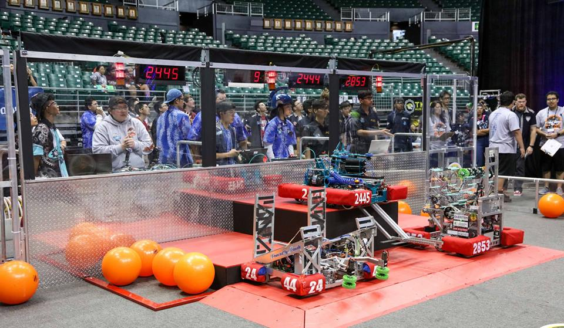

When I was a kid I was fascinated with how people would make mods for games that I played. I always looked for new mods that fit what I wanted to play, but a lot of mods didn't have everything I wanted. So, I took matters into my own hands and decided to make some for myself. It took me awhile to actually learn since there was no classes in school that could show me basics of programming, I had to learn everything myself. I went on this journey of learning programming in order to make mods that I wanted and it ignited an interest that at the time I never considered that it could lead to an actual career.

During my high school years I was still programming for fun making mods and playing games too much, but during my junior year of high school I was asked to join my school's robotics team as a programmer. During my time as a programmer I learned so much, like collaborating with others which I haven't done at that point since I was always a one man team. My prior programming experience was very helpful when joining the team as the past programmers graduated, so I had to yet again learn something new. After my time in robotics it I decided to go to college for computer science, before that I wasn't planning on going to college at all. Robotics was the biggest push for me to pursue a career in software development.

Currently, I work as a Java Web Programmer and I've been really enjoying it. Somethings I wish I could do at work is use frontend frameworks like React, Vue, Angular, etc. Since that's how modern web applications are made. We currently only use AngularJS which is better than nothing, but not necessarily the best. I've tried to use frontend frameworks before, but I've always given up on it as I haven't figured out the JavaScript ecosystem with Nodejs and frontend frameworks. I'm hoping in the future I figure out the ecosystem so I can have the skills to develop a modern enterprise web application.
