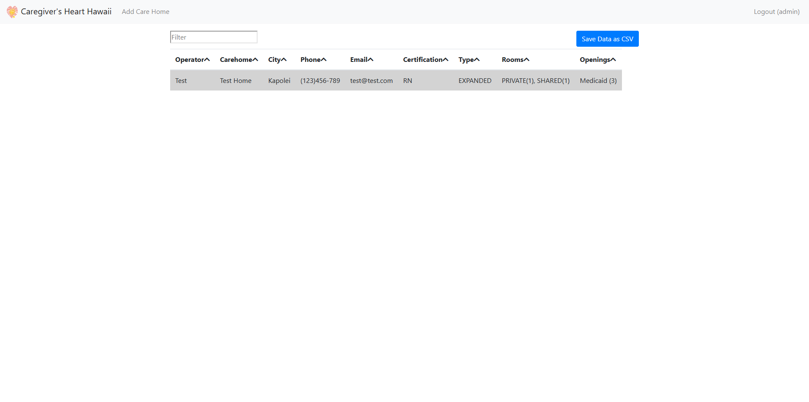
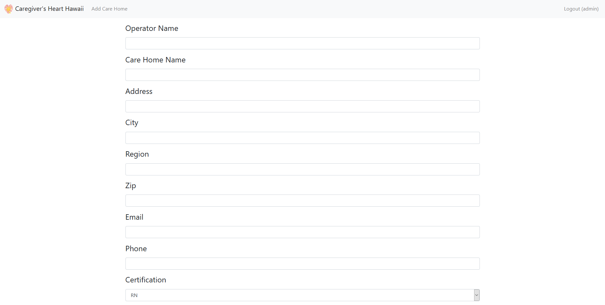
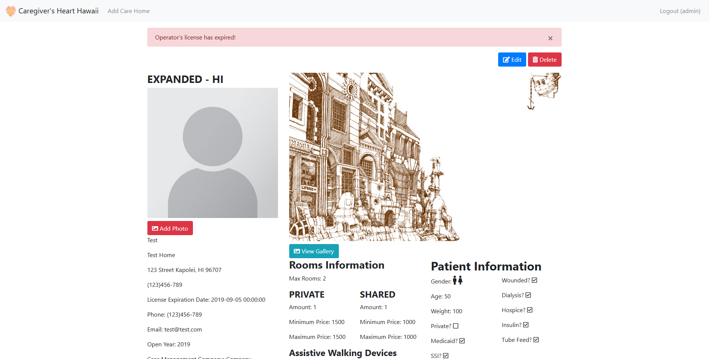
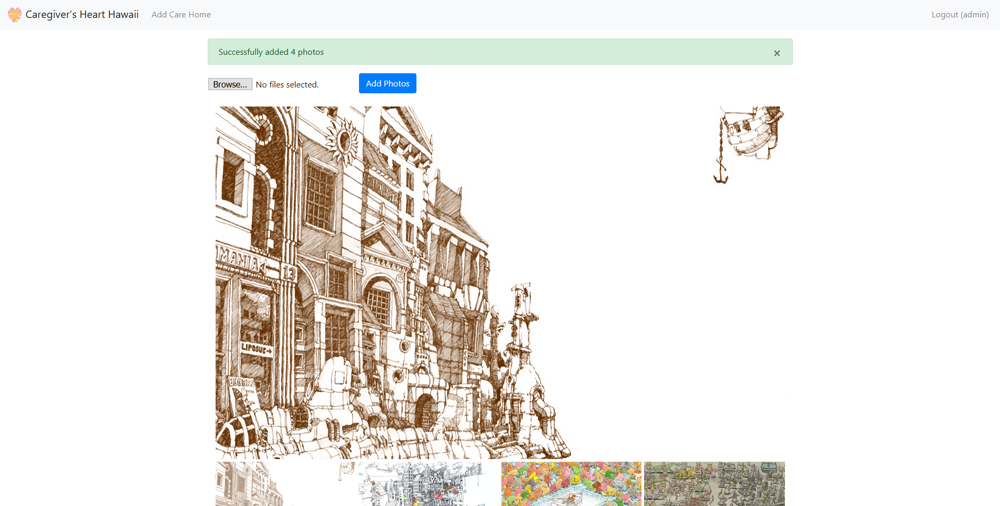

  
  
  
  

Carehome finder is a project that I made as a sample web application for a local business named Caregivers Heart Hawaii. The point of the application is to match patients that needs assisted living with carehomes that can accommodate them. The solution that they were using at the time was a large Excel spread sheet. They wanted a new solution for this as the Excel sheet was becoming a hassle to maintain and it was hard for the workers to look through the data. This was the first web application that I've developed and I gained a lot of learning experinece by making this project.

To make this project I used the programming language Python and the minimal web application framework [Flask](https://palletsprojects.com/p/flask/). For this application I used a simple Model, View, Controller (MVC) design pattern. To process the frontend of the application it uses a templating language called [Jinja](https://palletsprojects.com/p/jinja/) and it uses the library [Bootstrap 3](https://getbootstrap.com/docs/3.4/) for easy styling and responsive pages. Since this was my first web application I had to learn about HTTP protocols and how MVC works.

To use the application the user has to be authenticated through the login page before being able to do anything because of the Health Insurance Portability and Accountability Act (HIPAA). I had to make sure that patient data wasn't able to be seen by any unauthorized users. To also make sure user accounts could not be cracked the database does not store plaintext passwords. Before the user is registered the password they enter is hashed with SHA512 and salted and it sends the password hash to the database. When a user logs in the potential password they enter is hashed and salted and compares it with the hash that is in the database.

After the user is authenticated they can do simple data entry with forms for Carehomes. The home page grabs all the Carehome records and displays them in a table and the user is able to sort the data by different fields. Clicking on the table rows will allow the user to view that single Carehome's information. Users can edit any of the Carehome's data, add any notes, or delete the Carehome from the application.

Overall, doing this project was a huge learning experience for me and it peaked my interest in pursuing a career as a web developer. It helped me learn the basics of web development through HTML, CSS, HTTP protocols, MVC design pattern, cyber security, and MySQL. If I could do this again I would implement a REST API and feed it into a frontend framework like React.

You can view the source code of the project [here](https://github.com/lukemcd9/carehome-finder)
