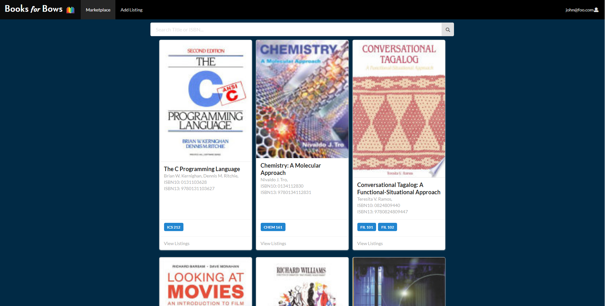

## Overview
Books for Bows is a web application written in pure JavaScript that I helped developed in a group with three other developers. It was a really great learning experience for frontend development with React and backend development with Meteor. The main point of the application is to cut out the middle man (the UH Bookstore) of selling and buying textbooks. It allows students to buy and sell textbooks to other textbooks, the application also shows what books are needed for certain courses.

## My Contribution

My main contribution to this project was connecting to an external API to grab information of books based off of their ISBNs. In the first iteration I used a database called [ISBNdb](https://isbndb.com/) and after structuring the app around using that database I later found out that to use the REST api for the database you had to pay for it monthly which I didn't want to do. I later found a free database called [OpenLibrary](https://openlibrary.org/) which was okay, but didn't have a lot of textbooks stored. I eventually wound up finding [Google's Books API](https://developers.google.com/books/). This was the first time I used a REST API so I had to learn how to send requests using Meteor and using the JSON that was returned to load book data on the web application. 
After connecting the web application to the Google Books API my task was to consume JSON data that was scraped from the UH Bookstore that contained textbooks and the courses that they were used in. After learning to consume JSON from the REST API, using the scraped JSON data was a lot easier to implement into the application.

This project helped me learn a lot, from working with a group using issue driven project development, consuming REST API JSON data, and frontend development through React. Developing these skills has majorly added to my professional skill set. If I was able to do anything different during this project, I would've liked to follow the agile development process more because my group didn't really follow the process as well as we should have. We could've met up a lot more in person so we could help each other with issues we were having or deciding what direction we should go in.

For more information on the app you can visit the [documentation page](https://books-for-bows.github.io/).

Source: <a href="https://github.com/books-for-bows/books-for-bows"><i class="large github icon"></i>books-for-bows</a>
